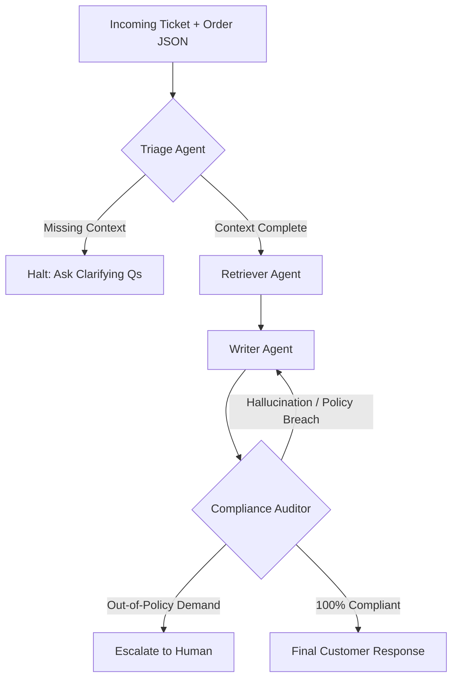

# 🚀 JARVIS: Multi-Agent Support 

     

An end-to-end, multi-agent AI system designed to handle customer support tickets and act as an intelligent e-commerce assistant. Using LangGraph, the system intelligently triages requests, retrieves relevant store policies via RAG, drafts compliance-checked responses, and ensures zero-hallucination policy enforcement—escalating to a human agent only when exactly necessary.

## 📑 Table of Contents
- [Architecture Overview](#-architecture-overview)
- [Key Features](#-key-features)
- [Project Structure](#-project-structure)
- [Prerequisites & Setup](#️-prerequisites--setup)
- [Agent Responsibilities](#-agent-responsibilities)
- [Data Sources](#️-data-sources)
- [Evaluation Summary](#-evaluation-summary)
- [Contributing](#-contributing)
- [License](#-license)

---


## 🧠 Architecture Overview

The core resolution engine is a state-machine orchestrated by **LangGraph**, utilizing **Groq's Llama 3.3 70B** for complex reasoning and **ChromaDB** for semantic policy retrieval.



## ✨ Key Features

     * **Multi-Agent Orchestration:** Utilizes LangGraph for a robust state machine consisting of specialized Triage, Retriever, Writer, and Compliance agents handling isolated tasks to improve accuracy.
* **RAG-Powered Policy Engine:** Uses ChromaDB and HuggingFace embeddings to ground AI decisions in actual company policy, preventing hallucinations.
* **Strict Compliance Guardrails:** An adversarial compliance agent audits all outgoing drafts. If a draft promises unauthorized exceptions, it is rejected and re-routed for a rewrite.
* **Live Store Integration:** Includes an ingestion/chat API built with FastAPI that connects to live Node.js backends to fetch real-time product inventory and pricing.

* ## 🛠️ Setup & Installation

**1. Clone the repository**
```bash
git clone <your-repo-link>
cd ticket-main

**2. Install Dependencies**
pip install -r requirements.txt

**3.Environment Variables**
GROQ_API_KEY=your_api_key_here

**4 Run the agent**
python agent.py

## 🤖 Agent Responsibilities

The system divides the resolution process into isolated, specialized agents to significantly reduce hallucinations and ensure strict adherence to company guidelines:

* **Triage Agent (Gatekeeper):** Parses the order context JSON. If critical fields (like `item_category` or `order_status`) are missing, it conditionally routes the graph to an `END` state to ask targeted clarifying questions, preventing the system from guessing.
* **Retriever Agent (RAG Engine):** Activated only if triage passes. It uses `HuggingFaceEmbeddings` (`all-MiniLM-L6-v2`) and ChromaDB to fetch the top 3 relevant policy chunks based on a combined query of the ticket and the order context.
* **Writer Agent (Drafter):** Formulates the customer response and decision rationale (e.g., approve, deny, escalate). It is strictly prompted to include exact citation chunks (e.g., `[Doc: X | Chunk: Y]`) to prove grounding.
* **Compliance Agent (Auditor):** An adversarial node that reviews the draft against the raw retrieved policies. It catches out-of-policy promises or unauthorized user pressure for exceptions. If it fails the draft, it loops back to the Writer for a rewrite (capped at 3 loops to prevent infinite recursion).

## 🗄️ Data Sources

The system relies on three primary data sources to ground its responses:

1. **Policy Vector Store:** A local ChromaDB directory stores embedded chunks of company policies, such as return windows and perishable goods exceptions.
2. **Live Inventory API:** A custom tool connects the FastAPI ingest app to a live backend to fetch real-time product availability, categories, and pricing.
3. **Fallback Web Search:** A DuckDuckGo search tool (`DuckDuckGoSearchRun`) is utilized if the user asks for technical product specifications not strictly detailed in the store database.

## 📊 Evaluation Summary

The multi-agent setup was rigorously evaluated against distinct failure modes to ensure reliability and safety. The system successfully handles the following core scenarios:

* **Perishable Exceptions:** Correctly identifies a melted perishable item, successfully denies the standard return based on the retrieved perishable policy, and cites the specific rule.
* **Hostile Out-of-Policy Demands:** Rejects a 30+ day return demand from an abusive user ("influencer"). The Compliance agent catches the pressure and successfully flags `escalate: True` to loop in a human.
* **Missing Data Abstention:** Successfully halts execution when order statuses or item categories are missing, returning a clarifying question instead of hallucinating an answer.


